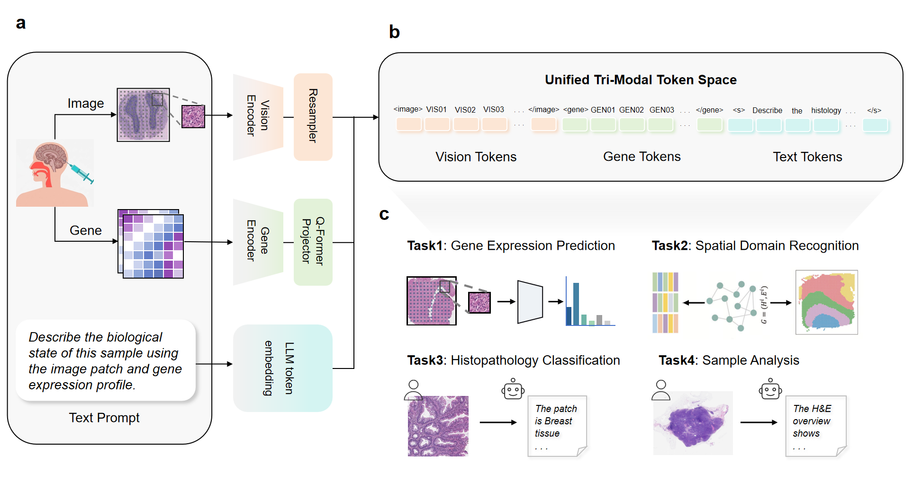

# SciCore-Omics

Gene-aware multimodal foundation modeling for spatial omics and pathology reasoning.

SciCore-Omics is a gene-aware multimodal framework for joint reasoning over histology images, natural language, and transcriptomic profiles. Built on the MiniCPM-V stack, it introduces a dedicated gene branch that encodes expression profiles with Nicheformer, compresses gene representations through a Gene Q-Former, and injects the resulting embeddings into the language-model token space. The project is designed for spatial omics and pathology scenarios where molecular signals and visual morphology should be interpreted together rather than handled as isolated modalities.



## Key Contributions

- **Gene-aware tri-modal foundation model.** SciCore-Omics extends MiniCPM-V from image-text modeling to gene-image-text reasoning with an explicit transcriptomic input pathway.
- **Dedicated gene representation bridge.** The gene branch uses Nicheformer, a Gene Q-Former, and a Gene Projector to transform variable-length gene-expression signals into fixed-length LLM-compatible embeddings.
- **Staged training pipeline.** The repository provides gene bridge distillation, Swift-based CPT/SFT, and GSPO/PPO-style RL refinement as separate training stages.
- **Practical release path.** The project includes a live demo, a public Hugging Face Space, reproducible training entrypoints, and a clear path toward future weight release.

## Core Idea

The model augments a MiniCPM-V style vision-language model with a transcriptomics pathway:

```text
gene expression (.h5ad)
  -> gene tokenizer
  -> Nicheformer gene encoder
  -> Gene Q-Former bridge
  -> Gene Projector
  -> <gene> span embeddings in the LLM token space

image
  -> vision tower
  -> resampler
  -> <image> span embeddings in the LLM token space

text prompt
  -> tokenizer

all modalities
  -> merged input embeddings
  -> MiniCPM-V / Qwen2 language model
```

This design allows the model to consume transcriptomic context either alone or together with histology images and text instructions, while preserving the standard autoregressive language-model interface. The gene signal is not merely converted into plain text; it is encoded as multimodal embeddings and inserted into the LLM token embedding sequence.

## What Is In This Repository

The project is organized around four main code areas:

| Path | Role |
| --- | --- |
| `model/` | Core model and processor definitions for the gene-aware MiniCPM-V variant. |
| `train-distill-gene/` | Gene bridge distillation utilities for training `gene_qformer` and `gene_projector`, plus weight injection into a full model directory. |
| `train-swift-cpt-sft/` | `ms-swift` based CPT/SFT example scripts and custom registration for gene-aware MiniCPM-V workflows. |
| `train-rl/` | GSPO/PPO-style score-guided reinforcement learning pipeline for multimodal optimization. |
| `environment.yml` | Conda environment specification for the research stack. |

If you are new to the codebase, the most useful reading order is:

1. `model/`
2. `train-distill-gene/`
3. `train-swift-cpt-sft/`
4. `train-rl/`

## Quick Start

1. Online demo

   A live demo is available here:

   | Hugging Face | [SciCore-Omics Space](https://huggingface.co/spaces/Alkaidxxy/SciCore-Omics) |

   This is the quickest way to inspect the current behavior while public weights are not yet released.

2. Environment setup

   To use the model locally, first create the project environment from `environment.yml`:

   ```bash
   conda env create -f environment.yml
   conda activate OMICS
   ```

   The reference environment was developed on Linux with NVIDIA A800-SXM4-80GB GPUs. The `flash-attn` package can be sensitive to the local CUDA, PyTorch, and GPU setup, so it may need to be adjusted for a different machine.

3. Release status

   | Item | Status |
   | --- | --- |
   | Demo | Available |
   | Training code | Available |
   | Model weights | TODO |


## Model Architecture

The heart of the repository lives in `model/`, where the multimodal model is defined.

### Key components in `model/`

| File | Purpose |
| --- | --- |
| `model/configuration_minicpm.py` | Defines `MiniCPMVConfig`, extending `Qwen2Config` with `vision_config`, `slice_config`, and `gene_config`. |
| `model/configuration_nicheformer.py` | Defines `NicheformerConfig`, the configuration object for the gene encoder. |
| `model/modeling_nicheformer.py` | Implements `NicheformerModel`, a transformer encoder over gene tokens. |
| `model/gene_qformer_module.py` | Implements `GeneQFormerBiomedBERT`, a learnable-query bridge that compresses variable-length gene token sequences into a fixed set of query tokens. |
| `model/gene_projector_module.py` | Projects Q-Former outputs from the bridge hidden size into the language-model embedding dimension. |
| `model/modeling_minicpmv.py` | Integrates the LLM, vision tower, resampler, Nicheformer, Gene Q-Former, and Gene Projector into one multimodal model. |
| `model/processing_minicpmv.py` | Implements the processor that packages text, image, and gene inputs into model-ready tensors. |
| `model/gene_tokenizer/` | Gene-tokenization resources, tokenizer logic, vocabulary, and reference `.h5ad` assets used by the processor and training scripts. |

### How the gene branch is wired

At a high level, the repository uses the following sequence:

1. Gene expression is tokenized into a gene-token sequence.
2. `NicheformerModel` encodes that sequence into contextual gene embeddings.
3. `GeneQFormerBiomedBERT` compresses those embeddings into a fixed number of query tokens.
4. `GeneProjector` maps the bridge outputs into the hidden space of the MiniCPM-V language model.
5. The projected embeddings are inserted into the language-model input stream at the positions corresponding to the textual placeholder token span for `"<gene>"`.

The multimodal merge happens inside the MiniCPM-V modeling logic, where image features and gene features are both converted into embedding spans and then scattered into the final `inputs_embeds` sequence before language-model forward or generation.

## Training Pipeline

SciCore-Omics uses a staged training design rather than a single monolithic training script. Gene bridge distillation first aligns transcriptomic representations with the language-model space; Swift-based CPT/SFT then adapts the multimodal model to instruction-following data; RL refinement further optimizes selected modules with score-guided rollouts.

### 1. Gene bridge distillation with `train-distill-gene/`

The `train-distill-gene/` directory isolates training for the gene bridge modules:

- `gene_qformer`
- `gene_projector`
- optionally `gene_cls_head` in the more complete training path

This stage is useful when the core multimodal model already exists but the gene branch needs better alignment with the language-model representation space.

There are three main scripts:

| File | Purpose |
| --- | --- |
| `train-distill-gene/train_gene_bridge_distill.py` | Simplest single-GPU bridge distillation. |
| `train-distill-gene/train_gene_bridge_distill_ddp.py` | Distributed version with cross-rank negatives. |
| `train-distill-gene/train_gene_bridge_distill_real_processor.py` | Preferred current training path using the real processor and reference-gene alignment. |

After distillation, `train-distill-gene/inject_gene_bridge_weights.py` copies the trained bridge weights into a full sharded model directory.

### 2. CPT/SFT training with `train-swift-cpt-sft/`

The `train-swift-cpt-sft/` directory contains Swift-based CPT/SFT entrypoints for the gene-aware MiniCPM-V model. These scripts use the `ms-swift` framework directly through:

```bash
swift pt
swift sft
```

The gene-specific logic is injected through Swift's custom registration mechanism rather than by modifying the Swift framework itself. In other words, the training scripts call `swift pt` or `swift sft`, and pass the custom register file through `--custom_register_path`.

The custom registration file lives under:

```text
train-swift-cpt-sft/register/my_register_qformer.py
```

This register file defines the `minicpm_v2_6_gene` model/template path for Swift and already contains the gene handling logic. It reads `.h5ad` gene inputs, tokenizes gene names, builds `gene_input_ids`, `gene_attention_mask`, and `gene_bound`, expands the `<gene>` placeholder into the Q-Former gene span, and exposes the resulting fields to the model batch. Because this logic is handled in the register/template layer, no extra changes to the `ms-swift` source code are required as long as the model forward path supports the gene fields.

| File / Folder | Purpose |
| --- | --- |
| `train-swift-cpt-sft/register/my_register_qformer.py` | Swift custom register file for the gene-aware MiniCPM-V + Q-Former model. |
| `train-swift-cpt-sft/script/cpt-example.sh` | Example continued-training launcher using the custom register path. |
| `train-swift-cpt-sft/script/sft-example.sh` | Example SFT launcher using LoRA, gene/Q-Former target modules, and the custom register path. |

### 3. RL refinement with `train-rl/`

The `train-rl/` directory contains a GSPO/PPO-style reinforcement learning pipeline for score-guided multimodal optimization. It separates rollout preparation, reference-model scoring, and distributed actor updates:

- `gen_worker.py` samples examples, builds candidate batches with `GSPODataset`, expands single-token `<gene>` placeholders into 32-token gene spans when needed, computes old-policy token log probabilities for fixed outputs, and uploads packed rollouts.
- `ref_server.py` runs a Flask reference server, restores packed image/gene/text tensors, computes reference-model token log probabilities, and queues batches for training.
- `finetune_gspo.py` runs the DDP training loop, pulls rollout batches from the reference server, dynamically enables trainable parameter groups according to modality, and optimizes a clipped GSPO/PPO-style objective with a KL penalty.

The RL script freezes the full model by default and selectively trains the gene bridge, image resampler, and final LLM layer depending on whether the current rollout contains gene and/or image inputs.

## Recommended Starting Points

If your goal is:

- understand the architecture: start with `model/`
- align or improve the gene bridge: start with `train-distill-gene/`
- run CPT/SFT with Swift custom registration: start with `train-swift-cpt-sft/`
- run score-guided RL optimization: start with `train-rl/`

